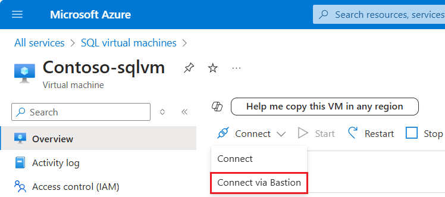

1. After the Azure virtual machine is created and running, select **Virtual machine**, and then choose your new VM. 

1. Select **Connect** and then choose **Connect via Bastion** from the drop-down to go to the **Bastion** page for your VM. 

   

1. Select **Deploy Bastion** and wait for the process to finish. 

1. After [Bastion](/azure/bastion/bastion-connect-vm-rdp-windows) is deployed successfully, choose the authentication type, enter authentication details, and then select **Connect**: 

   

   You may need to disable the pop-up blocker in your browser to open the Bastion session in a new browser tab. 

